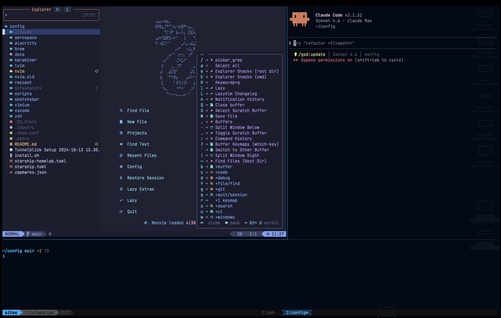
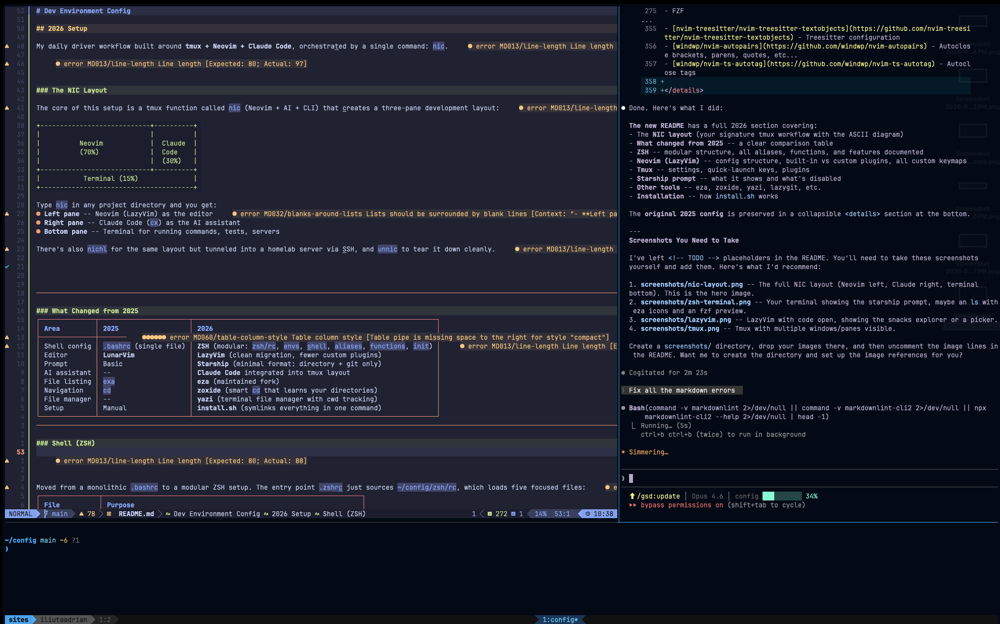
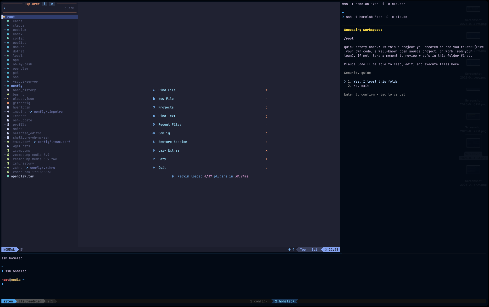
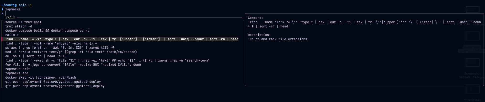

<!-- markdownlint-disable MD013 MD033 -->

# Dev Environment Config

<!--toc:start-->

- [Dev Environment Config](#dev-environment-config)
  - [2026 Setup](#2026-setup)
    - [The NIC Layout](#the-nic-layout)
    - [What Changed from 2025](#what-changed-from-2025)
    - [Shell (ZSH)](#shell-zsh)
      - [Key Aliases](#key-aliases)
      - [Key Functions](#key-functions)
      - [Shell Features](#shell-features)
    - [Neovim (LazyVim)](#neovim-lazyvim)
      - [Config Structure](#config-structure)
      - [What LazyVim Provides Out of the Box](#what-lazyvim-provides-out-of-the-box)
      - [Custom Plugins Added](#custom-plugins-added)
      - [Custom Keymaps](#custom-keymaps)
      - [Neovim Server Socket](#neovim-server-socket)
    - [Tmux](#tmux)
      - [Quick-Launch Keybindings (prefix +)](#quick-launch-keybindings-prefix)
      - [Plugins](#plugins)
    - [Starship Prompt](#starship-prompt)
    - [AeroSpace (macOS Window Manager)](#aerospace-macos-window-manager)
    - [Other Tools](#other-tools)
    - [Installation](#installation)
  - [2025 Setup (Archive)](#2025-setup-archive) - [Terminal ZSH Setup](#terminal-zsh-setup) - [TMUX Setup](#tmux-setup) - [Neovim Setup](#neovim-setup) - [Plugin Manager](#plugin-manager) - [Navigating Between Neovim Windows and Tmux](#navigating-between-neovim-windows-and-tmux) - [File Explorer](#file-explorer) - [Buffer Line](#buffer-line) - [Keymap Suggestions](#keymap-suggestions) - [Fuzzy Finder](#fuzzy-finder) - [Autocompletion](#autocompletion) - [Snippets](#snippets) - [Managing & Installing Language Servers, Linters & Formatters](#managing-installing-language-servers-linters-formatters) - [LSP Configuration](#lsp-configuration) - [Formatting & Linting](#formatting-linting) - [Comments](#comments) - [Treesitter Syntax Highlighting, Autoclosing & Text Objects](#treesitter-syntax-highlighting-autoclosing-text-objects)
  <!--toc:end-->

## 2026 Setup

My daily driver workflow built around
**tmux + Neovim + Claude Code**,
orchestrated by a single command: `nic`.





### The NIC Layout

The core of this setup is a tmux function called
`nic` (Neovim + AI + CLI) that creates a
three-pane development layout:

```text
+----------------------------+----------+
|                            |          |
|          Neovim            |  Claude  |
|          (70%)             |  Code    |
|                            |  (30%)   |
+----------------------------+----------+
|           Terminal (15%)              |
+---------------------------------------+
```

Type `nic` in any project directory and you get:

- **Left pane** -- Neovim (LazyVim) as the editor
- **Right pane** -- Claude Code (`cx`) as the AI assistant
- **Bottom pane** -- Terminal for commands, tests, servers

There's also `nichl` for the same layout but tunneled
into a homelab server via SSH,
and `unnic` to tear it down cleanly.



---

### What Changed from 2025

| Area         | 2025                    | 2026              |
| ------------ | ----------------------- | ----------------- |
| Shell config | `.bashrc` (single file) | **ZSH** (modular) |
| Editor       | **LunarVim**            | **LazyVim**       |
| Prompt       | Basic                   | **Starship**      |
| AI assistant | --                      | **Claude Code**   |
| File listing | `exa`                   | **eza**           |
| Navigation   | `cd`                    | **zoxide**        |
| File manager | --                      | **yazi**          |
| Setup        | Manual                  | **install.sh**    |

---

### Shell (ZSH)



Moved from a monolithic `.bashrc` to a modular ZSH setup.
The entry point `.zshrc` just sources `~/config/zsh/rc`,
which loads five focused files:

| File            | Purpose                                   |
| --------------- | ----------------------------------------- |
| `zsh/envs`      | PATH, editor, FZF/bat config              |
| `zsh/shell`     | History, vi mode, keybindings             |
| `zsh/aliases`   | Short commands (`ls`, `lg`, `cx`, `n`)    |
| `zsh/functions` | Utility functions (`nic`, `yy`, `fip`)    |
| `zsh/init`      | Tool init (starship, zoxide, fzf, direnv) |
| `zsh/local`     | Machine-specific overrides (not in git)   |

#### Key Aliases

| Alias               | What it does                            |
| ------------------- | --------------------------------------- |
| `n`                 | Open Neovim (current dir if no args)    |
| `nv <file>`         | Open file in existing Neovim instance   |
| `cx`                | Claude Code with full permissions       |
| `lg`                | Lazygit                                 |
| `t`                 | Attach or create tmux session           |
| `ls` / `lsa` / `lt` | eza with icons, tree view               |
| `ff`                | fzf with bat preview                    |
| `cd`                | zoxide smart navigation                 |
| `yy`                | Yazi file manager (changes cwd on exit) |

#### Key Functions

| Function                  | What it does                       |
| ------------------------- | ---------------------------------- |
| `nic [ai]`                | Open NIC dev layout                |
| `nichl [host]`            | Same layout but SSH'd into homelab |
| `unnic`                   | Tear down the layout cleanly       |
| `fip <host> <ports>`      | SSH port forwarding                |
| `dip <ports>`             | Stop port forwards                 |
| `img2jpg`, `img2png`      | Image conversion via ImageMagick   |
| `compress` / `decompress` | tar.gz helpers                     |

#### Shell Features

- **Vi mode** with cursor shape switching
- **History**: 32K entries, deduplication
- **Completions**: case-insensitive, colored, TAB cycling
- **Zapmarks** (`Ctrl+Z`): saved command bookmarks

---

### Neovim (LazyVim)

Migrated from **LunarVim** to **LazyVim**.
Much cleaner config -- LazyVim provides excellent defaults
and the custom layer is minimal.

#### Config Structure

```text
nvim/
  init.lua                  # bootstraps lazy.nvim
  lua/config/
    lazy.lua                # plugin manager setup
    options.lua             # wrap off, nvim server socket
    keymaps.lua             # custom keybindings
    autocmds.lua            # auto-reload + diffview refresh
  lua/plugins/
    snacks.lua              # dashboard, picker, explorer
    tmux-navigator.lua      # Ctrl+h/j/k/l between panes
    diffview.lua            # git diff with auto-refresh
    undotree.lua            # visual undo history
```

#### What LazyVim Provides Out of the Box

- **snacks.nvim** -- picker, explorer, dashboard, notifications
- **blink.cmp** -- fast autocompletion
- **conform.nvim** + **nvim-lint** -- formatting and linting
- **flash.nvim** -- jump navigation
- **which-key.nvim** -- keymap discovery
- **noice.nvim** -- better UI for messages and cmdline
- **trouble.nvim** -- diagnostics list
- **mini.surround** -- surround motions (enabled as extra)
- **bufferline.nvim** + **lualine.nvim** -- tabs and statusline

#### Custom Plugins Added

| Plugin                         | Purpose                       |
| ------------------------------ | ----------------------------- |
| [vim-tmux-navigator][tmux-nav] | `Ctrl+h/j/k/l` between panes  |
| [diffview.nvim][diffview]      | Git diff viewer, auto-refresh |
| [undotree][undotree]           | Visual undo history           |

[tmux-nav]: https://github.com/christoomey/vim-tmux-navigator
[diffview]: https://github.com/sindrets/diffview.nvim
[undotree]: https://github.com/mbbill/undotree

#### Custom Keymaps

| Key                 | Mode  | Action                        |
| ------------------- | ----- | ----------------------------- |
| `<leader>W`         | n,i,v | Save file                     |
| `<leader>Q`         | n     | Close buffer                  |
| `J` / `K`           | v     | Move selected text down/up    |
| `U`                 | n     | Redo                          |
| `+` / `-`           | n     | Increment / decrement number  |
| `!` `@` `#` `$` `%` | n     | Jump to buffer 1-5            |
| `<C-h/l/j/k>`       | i     | Arrow movement in insert mode |
| `<C-e>` / `<C-a>`   | n,i   | End / start of line           |
| `<C-b>` / `<C-f>`   | i     | Word backward / forward       |
| `<leader>a`         | n     | Select all                    |
| `<leader>rr`        | n     | Reload file                   |
| `<leader>gv`        | n     | Open Diffview                 |
| `<leader>gV`        | n     | Current file history          |
| `<leader>ut`        | n     | Toggle undo tree              |

#### Neovim Server Socket

A server socket is started at `~/.cache/nvim/server.pipe`,
allowing external tools (like Claude Code via `nv <file>`)
to open files in the running Neovim instance.

---

### Tmux

| Setting      | Value                             |
| ------------ | --------------------------------- |
| Prefix       | `Ctrl+s` (instead of `Ctrl+b`)    |
| Split panes  | `\|` horizontal, `-` vertical     |
| Resize panes | `h/j/k/l` with prefix             |
| Mouse        | Enabled (with pbcopy integration) |
| Vi mode      | Enabled for copy mode             |
| Base index   | 1 (windows and panes start at 1)  |

#### Quick-Launch Keybindings (prefix +)

| Key   | Opens                             |
| ----- | --------------------------------- |
| `g`   | Lazygit in new window             |
| `y`   | Yazi file manager in new window   |
| `b`   | Btop system monitor in new window |
| `q`   | TinyQuery launcher in new window  |
| `t`   | New window (replaces current)     |
| `C-u` | URL picker from pane content      |

#### Plugins

- **tpm** -- plugin manager
- **vim-tmux-navigator** -- pane navigation with Neovim
- **tmux-resurrect** + **tmux-continuum** -- persist sessions
- **tmux-copycat** -- regex search in tmux
- **tmux-open** -- open URLs and files from tmux

---

### Starship Prompt

Minimal prompt showing only what matters:

```text
~/projects/my-app main ~1 +2
❯
```

- **Directory**: full path, no truncation
- **Git branch**: branch name
- **Git status**: modified, staged, untracked counts
- **Vi mode indicator**: `❯` (insert) / `❮` (normal)
- Everything else disabled

Separate `starship-homelab.toml` adds `user@hostname`
for SSH sessions.

---

### AeroSpace (macOS Window Manager)

Tiling window manager for macOS.
Config at `aerospace/aerospace.toml`.

---

### Other Tools

| Tool        | Purpose                                    |
| ----------- | ------------------------------------------ |
| **fzf**     | Fuzzy finder (history, files, completions) |
| **bat**     | Syntax-highlighted `cat` replacement       |
| **eza**     | Modern `ls` with icons and git status      |
| **zoxide**  | Smart `cd` that learns your directories    |
| **yazi**    | Terminal file manager                      |
| **lazygit** | Terminal git UI                            |
| **direnv**  | Auto-load `.envrc` per project             |
| **ripgrep** | Fast grep (used by Neovim pickers)         |
| **Nix**     | Package manager (used on homelab)          |

---

### Installation

```bash
git clone <repo> ~/config
cd ~/config
./install.sh
```

The install script symlinks:

- `~/.zshrc` -> `~/config/.zshrc`
- `~/.config/starship.toml` -> `~/config/starship.toml`
- `~/.config/nvim` -> `~/config/nvim`
- `~/.config/aerospace` -> `~/config/aerospace` (macOS only)

Tmux config (`~/.tmux.conf`) is in the repo
but linked manually.

---

---

## 2025 Setup (Archive)

<details>
<summary>Click to expand the original 2025 configuration</summary>

### Terminal ZSH Setup

- FZF
- BAT
- EXA

![Terminal ZSH][zsh-2025]

[zsh-2025]: https://github.com/iliutaadrian/DEV-ENV-config/assets/11472785/2aee9256-9611-42d1-9f67-6cf779cee695

### TMUX Setup

![TMUX Setup][tmux-2025]

[tmux-2025]: https://github.com/iliutaadrian/DEV-ENV-config/assets/11472785/705b4dbd-806c-4dfb-96c8-c5aec7214098

### Neovim Setup

Needs: fzf, ripgrep, cmake

![Neovim 1][nvim-2025-1]

![Neovim 2][nvim-2025-2]

[nvim-2025-1]: https://github.com/iliutaadrian/DEV-ENV-config/assets/11472785/92cc63ec-eddc-42b2-9b69-ef608d4d600e
[nvim-2025-2]: https://github.com/iliutaadrian/DEV-ENV-config/assets/11472785/9e33807b-ce4a-4cf4-9eef-8df864a80ed8

#### Plugin Manager

- [lazy.nvim](https://github.com/folke/lazy.nvim)

#### Navigating Between Neovim Windows and Tmux

- [vim-tmux-navigator][tmux-nav]

#### File Explorer

- [nvim-tree.lua](https://github.com/nvim-tree/nvim-tree.lua)

#### Buffer Line

- [bufferline.nvim](https://github.com/akinsho/bufferline.nvim)

#### Keymap Suggestions

- [which-key.nvim](https://github.com/folke/which-key.nvim)

#### Fuzzy Finder

- [telescope-fzf-native.nvim][tele-fzf]
- [telescope.nvim][tele]
- [dressing.nvim](https://github.com/stevearc/dressing.nvim)

[tele-fzf]: https://github.com/nvim-telescope/telescope-fzf-native.nvim
[tele]: https://github.com/nvim-telescope/telescope.nvim

#### Autocompletion

- [nvim-cmp](https://github.com/hrsh7th/nvim-cmp)
- [cmp-buffer](https://github.com/hrsh7th/cmp-buffer)
- [cmp-path](https://github.com/hrsh7th/cmp-path)
- [lspkind.nvim](https://github.com/onsails/lspkind.nvim)

#### Snippets

- [LuaSnip](https://github.com/L3MON4D3/LuaSnip)
- [friendly-snippets][fsnip]
- [cmp_luasnip](https://github.com/saadparwaiz1/cmp_luasnip)

[fsnip]: https://github.com/rafamadriz/friendly-snippets

#### Managing & Installing Language Servers, Linters & Formatters

- [mason.nvim](https://github.com/williamboman/mason.nvim)

#### LSP Configuration

- [mason-lspconfig.nvim][mason-lsp]
- [nvim-lspconfig][lspconfig]
- [cmp-nvim-lsp](https://github.com/hrsh7th/cmp-nvim-lsp)

[mason-lsp]: https://github.com/williamboman/mason-lspconfig.nvim
[lspconfig]: https://github.com/neovim/nvim-lspconfig

#### Formatting & Linting

- [conform.nvim](https://github.com/stevearc/conform.nvim)
- [nvim-lint](https://github.com/mfussenegger/nvim-lint)
- [mason-tool-installer.nvim][mason-tools]

[mason-tools]: https://github.com/WhoIsSethDaniel/mason-tool-installer.nvim

#### Comments

- [Comment.nvim](https://github.com/numToStr/Comment.nvim)
- [nvim-ts-context-commentstring][ts-comment]

[ts-comment]: https://github.com/JoosepAlviste/nvim-ts-context-commentstring

#### Treesitter Syntax Highlighting, Autoclosing & Text Objects

- [nvim-treesitter][ts]
- [nvim-treesitter-textobjects][ts-text]
- [nvim-autopairs](https://github.com/windwp/nvim-autopairs)
- [nvim-ts-autotag](https://github.com/windwp/nvim-ts-autotag)

[ts]: https://github.com/nvim-treesitter/nvim-treesitter
[ts-text]: https://github.com/nvim-treesitter/nvim-treesitter-textobjects

</details>
